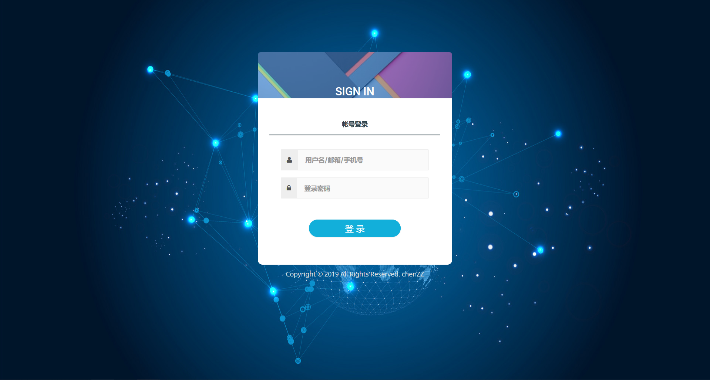
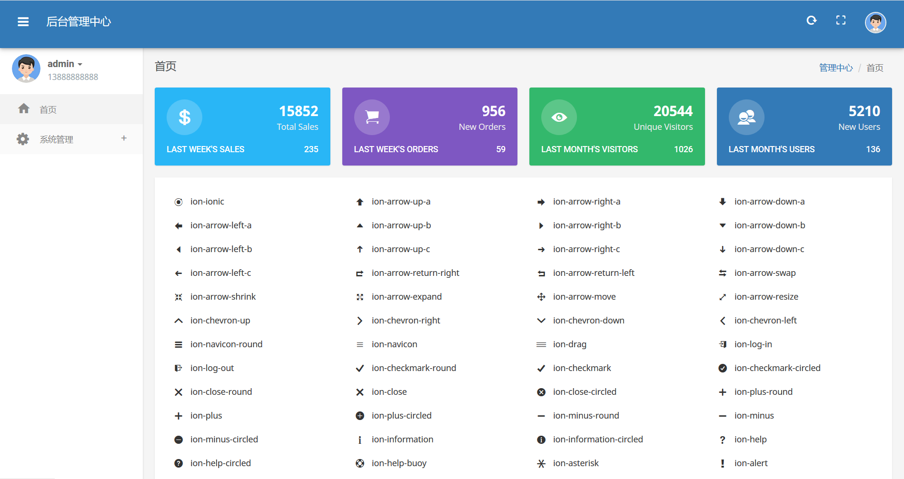
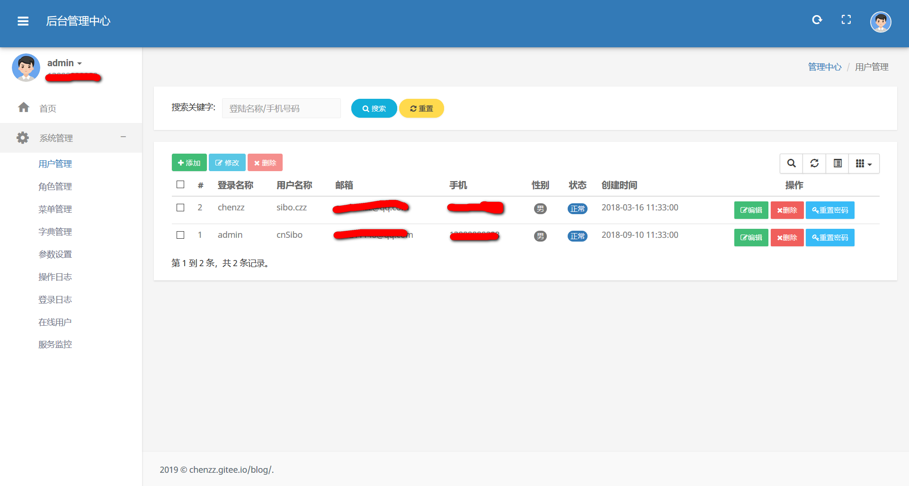
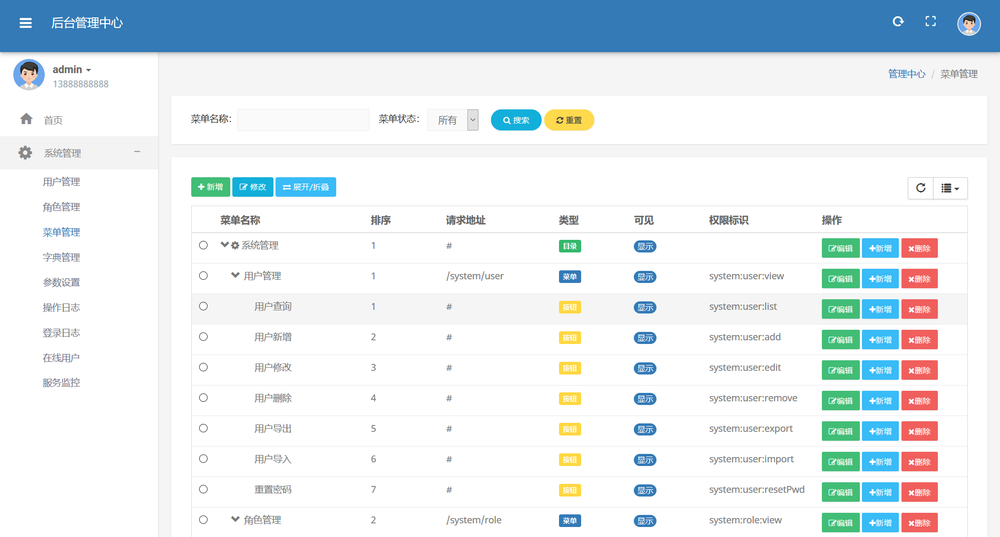
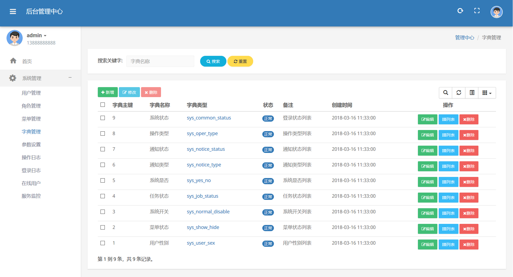
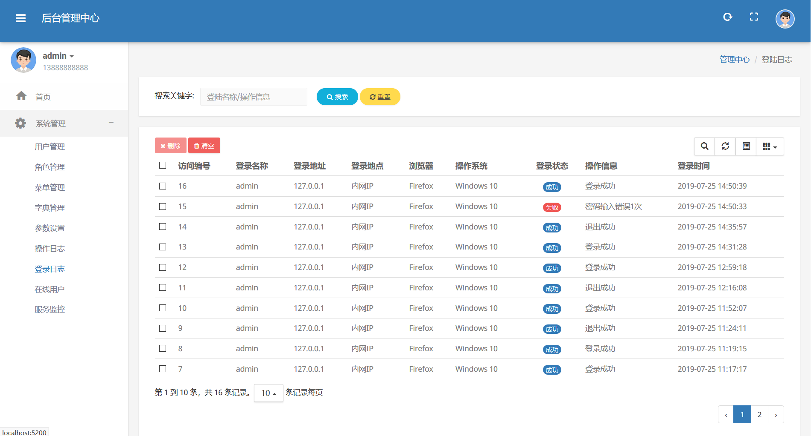
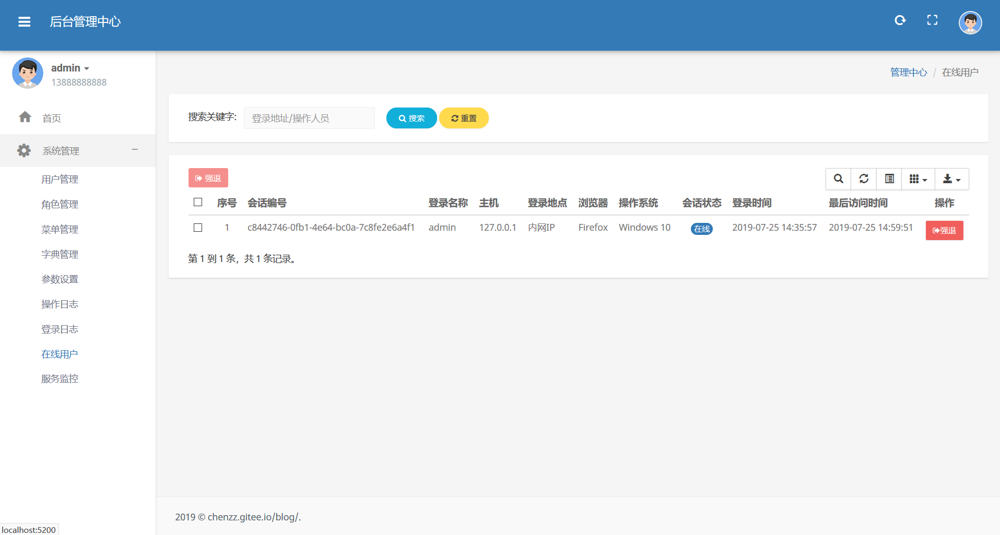

#### 项目介绍

本后台权限管理系统是在公司所用后台管理平台基础上，提取出通用功能进行重新设计,界面参考moltran,ui美观大方

去除不需要的和具体平台相关比较大的功能,整合了后台Api框架,可用来服务App端的接口调用

#### 软件架构
软件架构说明

#### 主要功能
- 用户管理,配置用户角色,权限
- 角色管理,角色授权
- 菜单管理
- 字典管理
- 登陆日志
- 操作日志

## 演示图

<table>
    <tr>
        <td></td>
    </tr>
    <tr>
        <td></td>
    </tr>
    <tr>
        <td></td>
    </tr>
    <tr>
        <td></td>
    </tr>
    <tr>
        <td></td>
    </tr>
    <tr>
        <td></td>
    </tr>
    <tr>
        <td></td>
    </tr>
    <tr>
        <td></td>
    </tr>
    <tr>
        <td></td>
    </tr>
    <tr>
        <td></td>
    </tr>
    
</table>