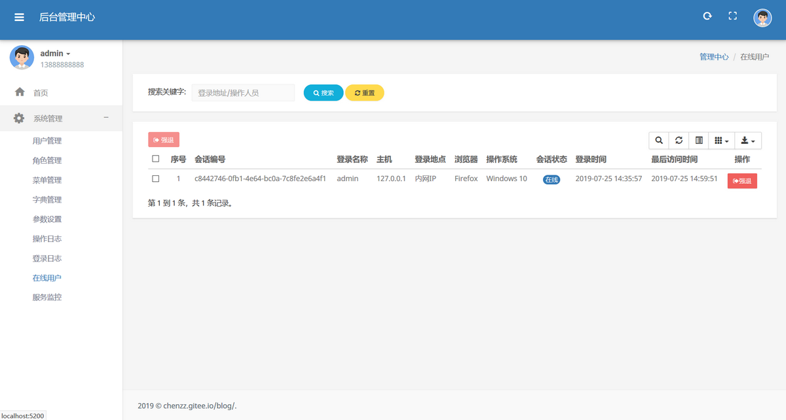

### 项目介绍

本后台权限管理系统是在公司所用后台管理平台基础上，提取出通用功能进行重新设计,界面参考moltran,ui美观大方

去除不需要的和具体平台相关比较大的功能,整合了后台Api框架,可用来服务App端的接口调用

### 系统需求

- JDK >= 1.8
- MySQL >= 5.5
- Maven >= 3.0

### 主要特性
- 完全响应式布局（支持电脑、平板、手机等所有主流设备）
- 支持按钮及数据权限。
- 完善的XSS防范及脚本过滤，彻底杜绝XSS攻击
- 国际化支持，服务端及客户端支持
- 完善的日志记录体系简单注解即可实现

### 主要功能
- 用户管理,配置用户角色,权限
- 角色管理,角色授权
- 菜单管理
- 字典管理
- 登陆日志
- 操作日志

## **技术选型**

**1、系统环境**

- Java EE 8
- Servlet 3.0
- Apache Maven 3

**2、主框架**

- Spring Boot 2.1.x
- Spring Framework 5.0
- Apache Shiro 1.4

**3、持久层**

- MyBatis Plus 3.1.0
- Alibaba Druid 1.1

**4、视图层**

- Bootstrap 3.3
- Moltran
- Thymeleaf 3.0

### 演示图

<table>
    <tr>
        <td></td>
    </tr>
    <tr>
        <td></td>
    </tr>
    <tr>
        <td></td>
    </tr>
    <tr>
        <td></td>
    </tr>
    <tr>
        <td></td>
    </tr>
    <tr>
        <td></td>
    </tr>
    <tr>
        <td></td>
    </tr>
    <tr>
        <td></td>
    </tr>
    <tr>
        <td></td>
    </tr>
    <tr>
        <td></td>
    </tr>
    
</table>